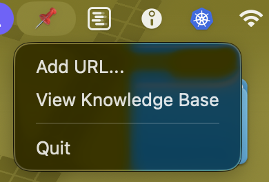
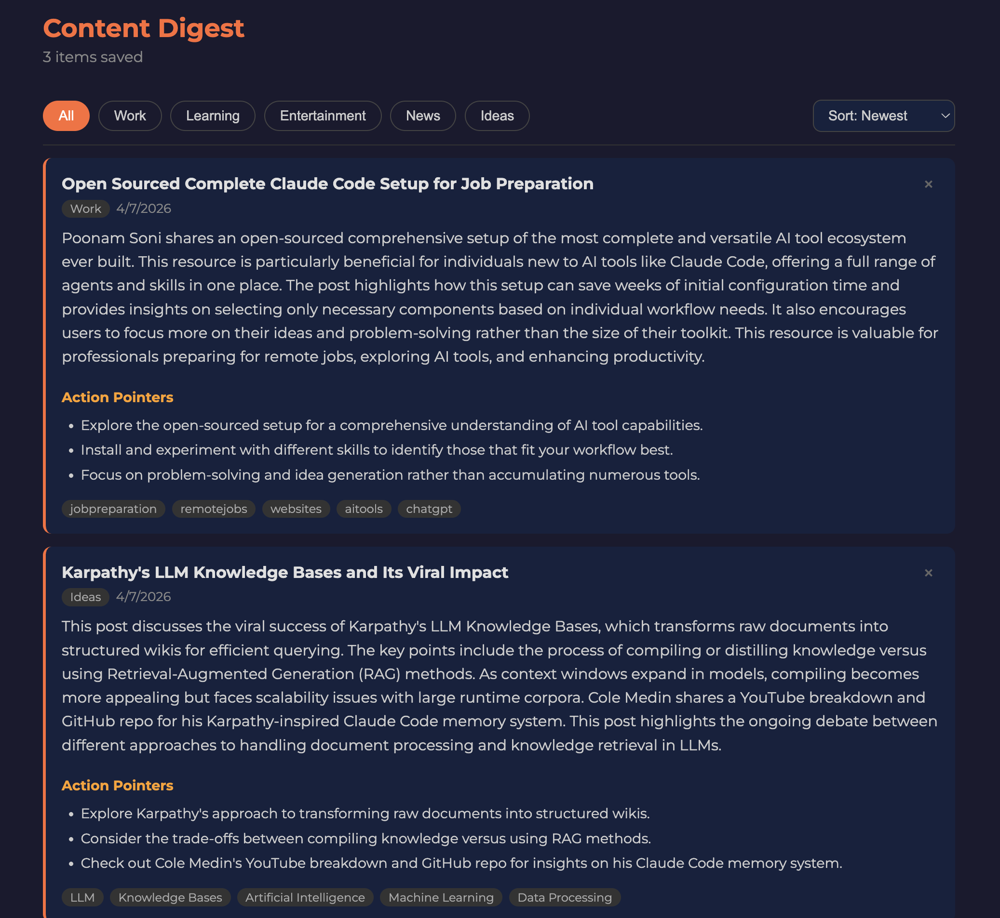

# Content Digest

A free, private, local-AI-powered knowledge base that lives in your Mac menu bar.

Save any article, LinkedIn post, Reddit thread, or webpage with one click from your Mac or iPhone. Get an instant AI summary with action pointers, auto-categorized into a searchable knowledge base, with zero subscriptions and zero data leaving your devices.

## Screenshots

## What It Does

- One-click saving from Mac menu bar or iPhone Share Sheet
- AI summarization with 150-200 word summaries and action pointers
- Auto-categorization into Work, Learning, Entertainment, News, Ideas
- Auto-tagging for every saved item
- Searchable knowledge base with filters and sort
- 100% local and free, runs on your own machine via LM Studio

## How It Works

1. Click the pin icon in your menu bar or tap Share on iPhone
2. Paste or share any URL
3. Local AI via LM Studio fetches and analyzes the content
4. Summary and action pointers appear in your knowledge base instantly

## Requirements

- macOS
- Python 3.6+
- LM Studio at https://lmstudio.ai with any capable local model loaded

## Setup

    git clone https://github.com/ShashankKarpal/content-digest-app.git
    cd content-digest-app
    pip3 install rumps --break-system-packages
    python3 app.py

LM Studio must be running with a model loaded and local server started on port 1234.

## iPhone Share Extension

Uses iOS Shortcuts to send URLs from any app directly to your Mac over local WiFi.

Steps:
1. Open Shortcuts app on iPhone
2. Create new shortcut with URL action pointing to http://YOUR-MAC-IP:7778/add
3. Add Get Contents of URL action with POST method and url: Shortcut Input in JSON body
4. Enable Show in Share Sheet in shortcut settings

## Credits

Reddit Tab Harvester Chrome extension originally built by sunlesshalo at https://github.com/sunlesshalo/reddit-tab-harvester and extended with LM Studio support, LinkedIn harvesting, and unified knowledge base.

Mac menu bar app and iPhone integration built using Claude by Shashank Karpal.

## License

MIT
