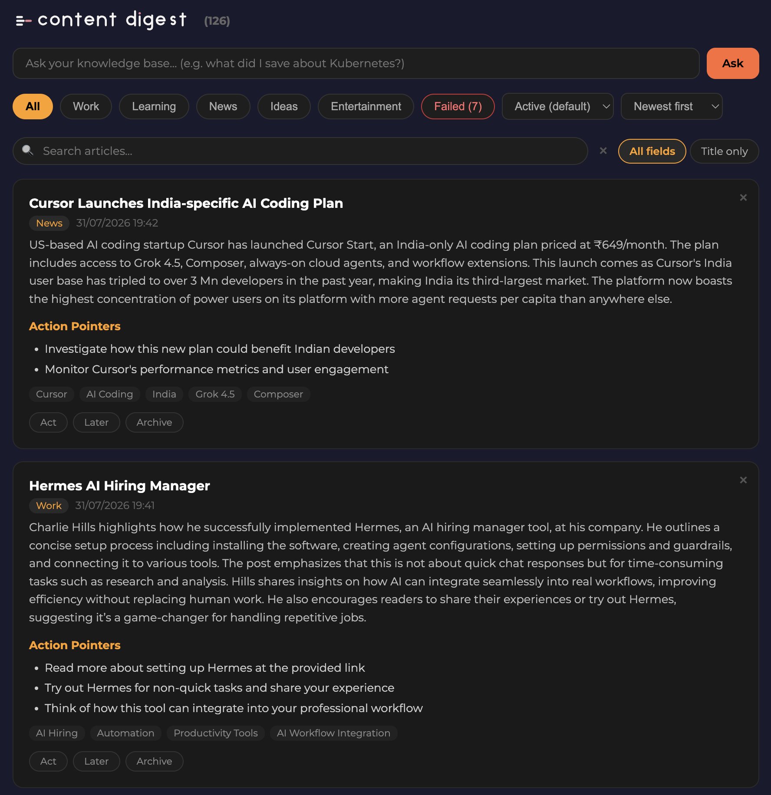
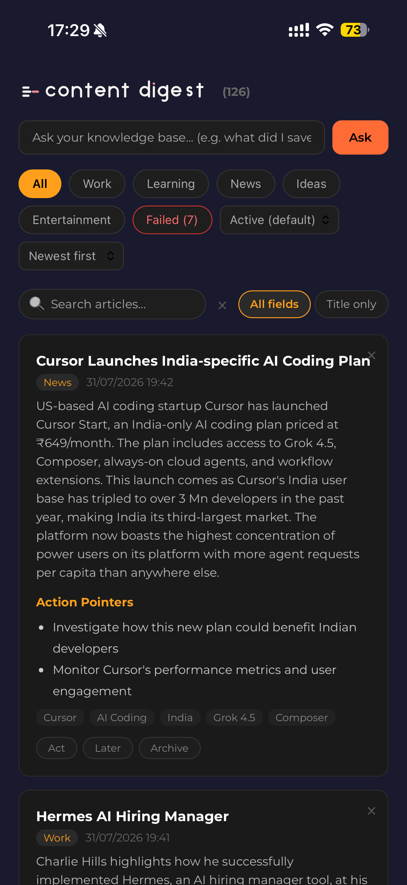
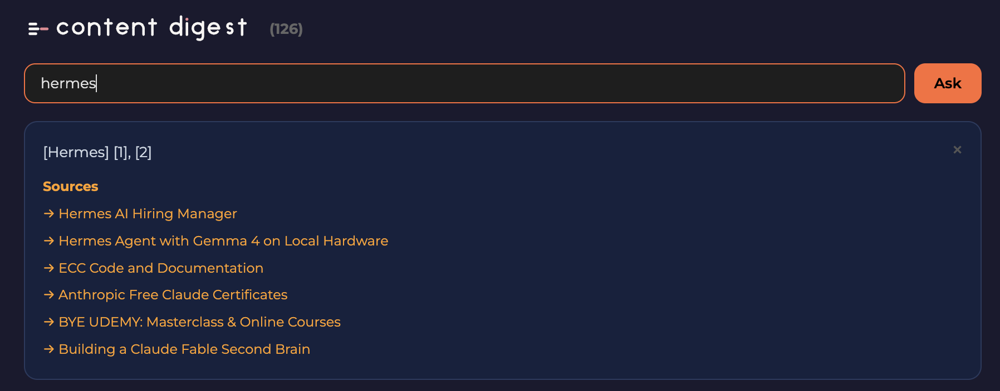
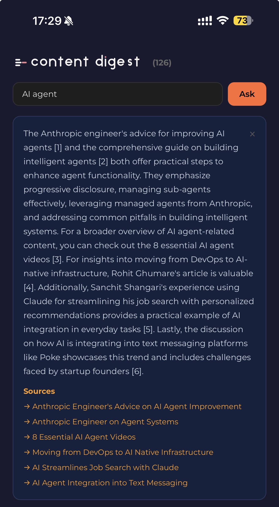
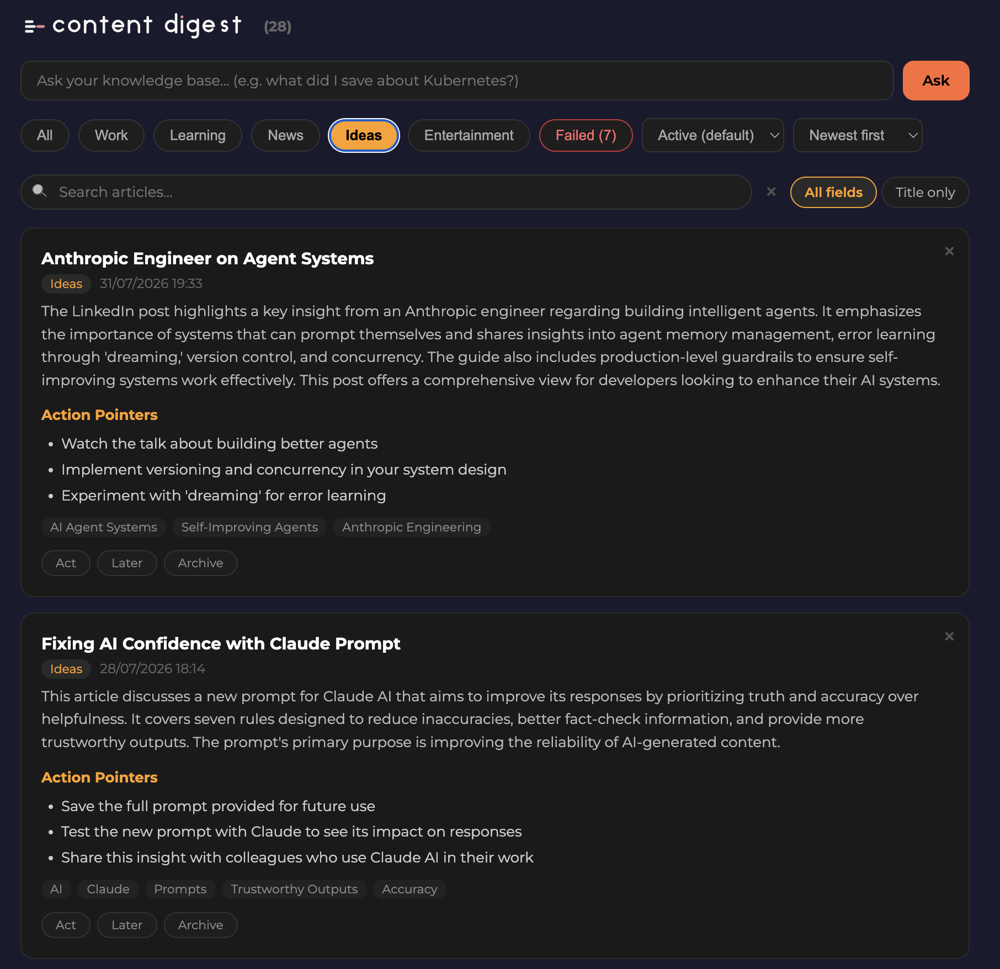
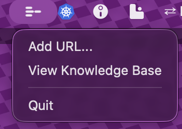
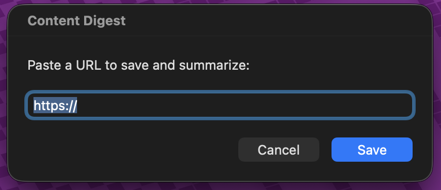

<p align="center">
  <picture>
    <source media="(prefers-color-scheme: dark)"  srcset="design/github/readme-banner-dark-1400x400.png">
    <source media="(prefers-color-scheme: light)" srcset="design/github/readme-banner-light-1400x400.png">
    
  </picture>
</p>

<h1 align="center">Content Digest</h1>

<p align="center"><b>Saves anything you find, summarizes it with a local LLM, and turns it into a knowledge base you can question.</b></p>

<p align="center">
  
  
  
  
  <a href="LICENSE"></a>
</p>

## What it does

- Saves a URL from the Mac menu bar, the iPhone share sheet, a Chrome extension, or a Shortcut.
- Summarizes each item in 150 to 200 words with action pointers, using a local model.
- Categorizes and tags every item automatically.
- Answers plain-language questions about everything you have saved.
- Emails a morning brief of new saves plus three backlog items with one-tap triage links.
- Auto-archives what you keep ignoring, so the backlog cannot become a guilt pile.
- Keeps storage and summarization on your own machine, local-first with an optional cloud fallback.

## Features

### Capture

- **Menu bar capture.** Click the icon, paste a URL, get a summary in seconds.
- **iPhone share sheet.** A Shortcut posts to the server's authenticated endpoint.
- **Chrome extension.** One click sends rendered page text, so logged-in-only pages such as Reddit and LinkedIn work.
- **Inbox capture before auth.** URLs are accepted first and processed after, so nothing is dropped.
- **Self-healing capture.** Fetch failures retry every 6 hours up to 3 attempts; inbox URLs that never became items are re-queued.
- **URL normalization.** Tracking parameters (`utm_*`, `fbclid`, `share_id`, `si`) are stripped before dedupe and storage.
- **Canonical URL dedupe.** The same article saved twice stays one item.

### Extraction

- **Source-aware extractor registry.** Per-source handlers rather than one parser for everything.
- **Reddit without API approval.** Threads and top comments from old.reddit.com, with the arctic-shift archive as automatic fallback.
- **YouTube transcripts.** Pulled via `youtube-transcript-api`.
- **X posts.** Fetched through fxtwitter.
- **Everything else via trafilatura.** Replaced the original regex extraction and made summaries materially cleaner.
- **Reader-proxy fallback.** Blocked sites route through a reader proxy instead of failing.
- **Fetch failure guard.** If extraction fails, the model is never called and you get a clear notification instead of a fabricated summary.

### Knowledge base

- **Ask your knowledge base.** A question box over your own saved items, using local Ollama embeddings (`nomic-embed-text`) with keyword fallback, answering with cited sources.
- **Item states.** Mark any card Act, Later, or Archive; states filter the base and appear in the brief.
- **Search and sort.** Full-text search with date and time on every card.
- **Persistent delete.** Removing an item removes it from storage, not just the view.
- **LLM output validation.** Category whitelist, relevance bounds, and shape checks before anything is saved.

### Close the loop

- **Resurfacing brief.** Every morning email pulls up to 3 items back out of the backlog (age x relevance, act-marked first, category-diverse, 5-day cooldown per item).
- **One-tap triage from the email.** Each resurfaced item carries HMAC-signed Act / Later / Archive links (72-hour expiry); one tap sets the state, no app open needed.
- **Triage deck.** A Review button on the knowledge base opens one card at a time: Act, Later, Archive, or Skip, with keyboard shortcuts (a / l / x / space) and a completion state. Max 10 cards per run.
- **Auto-archive decay.** Untouched items age out (News after 7 days, everything else after 21), and an item resurfaced 3 times with no response archives regardless. Reversible, and the brief reports the count.
- **One fatigue ledger.** The brief and the deck share a scorer and a cooldown store, so the same item is never pushed at you twice in a day.

### Daily brief

- **Morning email brief.** HTML digest sent on a LaunchAgent schedule.
- **Item states as pills.** Archived items are excluded.
- **Timezone-aware timestamps.**

### Model routing

- **Local first.** Ollama on the local machine does the summarizing.
- **Cloud fallback.** Groq is used only when the local model is unreachable, and only if you set a key.

## Stack

- App: Python, rumps menu bar client
- Extraction: trafilatura, youtube-transcript-api
- Local inference: Ollama
- Fallback inference: Groq (optional, off unless a key is set)
- Storage: plain JSON, plain HTML knowledge base
- Capture surfaces: iOS Shortcuts, Chrome extension (Manifest V3)

## Install

Requires: Python 3.11 or later, Ollama running locally, Homebrew.

```bash
git clone https://github.com/ShashankKarpal/content-digest-app.git
cd content-digest-app
pip3 install -r requirements.txt --break-system-packages
ollama pull qwen2.5:3b              # the summarizer
ollama pull nomic-embed-text        # optional, enables semantic ask
python3 server.py                   # the server (port 7778)
python3 client.py                   # optional: the menu bar client
```

## Configuration

Copy `secrets.example.json` to `secrets.json` and fill it in. `secrets.json` and `config.json` are gitignored and never committed.

```json
{
  "auth_token": "YOUR_TOKEN_HERE",
  "groq_api_key": "YOUR_GROQ_KEY_HERE",
  "smtp_user": "YOUR_EMAIL_HERE",
  "smtp_password": "YOUR_APP_PASSWORD_HERE",
  "recipient": "YOUR_EMAIL_HERE"
}
```

Set the server address in `local_settings.py` (also gitignored). Never commit a LAN, tailnet, or VPN address.

The daily brief reads SMTP settings from `config.json` (gitignored). Set `server_base` there (for example your machine's tailnet address, `http://100.x.y.z:7778`) so the brief's one-tap triage links point at the server. **Tailnet dependency:** triage links are plain HTTP to that address and are HMAC-signed with a 72-hour expiry, but the tap only works from a device that can reach the server, meaning the same tailnet (Tailscale) or home LAN. On any other network the link times out; the item stays put and resurfaces again.

Real credentials live only on local machines. Nothing in this repository holds a working secret.

## Network exposure

The server binds `0.0.0.0:7778` but refuses any connection that does not come from loopback, an RFC1918 private range, or the Tailscale CGNAT block (100.64/10). Every POST endpoint, including `/delete`, `/state`, and `/ask`, requires the bearer token or a valid session cookie, and the knowledge base at `/view` is locked behind a one-time `/view?token=YOUR_AUTH_TOKEN` unlock per browser (it sets a year-long session cookie; the token itself is never stored in the browser). Placeholder token values are treated as no token at all: the server rejects everything until a real random token is set.

Still: do not port-forward this, and prefer a tailnet (Tailscale) for remote access. There is no TLS; on a hostile local network, traffic is readable in transit.

## Usage

**iPhone Shortcut.** Create a shortcut with a Get Contents of URL action:

- URL: `http://YOUR_MAC_IP:7778/add`
- Method: POST
- Headers: `Authorization: Bearer YOUR_AUTH_TOKEN`
- Body: JSON with key `url`

**Chrome extension.** Open `chrome://extensions`, enable Developer mode, Load unpacked, select `extension/`. Set your server URL and auth token in the extension options.

## Project structure

```
server.py         HTTP server: extraction, summarization, knowledge base, triage, decay
client.py         menu bar client (sends URLs to the server)
extractors.py     per-source extractor registry
daily_brief.py    morning email brief with backlog resurfacing
extension/        Chrome extension
design/           brand assets, tokens, BRAND.md
docs/             product intent, roadmap, decision log, worklog, audits
screenshots/      UI screenshots
```

## Screenshots

**Knowledge base on Mac.** Every saved link lands here summarized, with action pointers, auto-tags, and Act / Later / Archive states.



**Knowledge base on iPhone.** The same view from Safari on iOS; add it to the home screen and it opens like a native app.



**Ask your KB.** Natural-language questions answered from saved items only, with cited sources. On Mac and iPhone.





**Category filters.** One tap isolates a category; here, everything saved as an Idea.



**Capture from the menu bar.** The brand icon lives in the Mac menu bar; Add URL takes a link, the pipeline does the rest.

| Menu bar | Add URL |
| --- | --- |
|  |  |

## Roadmap

| Version | Goal | Status |
|---|---|---|
| v0.1 | Frictionless capture and trustworthy summaries | Shipped |
| v0.2 | Return loop: digest email and item states | Shipped |
| v0.3 | Search, timezone-aware timestamps, reader-proxy fallback | Shipped |
| v0.4 | Reddit, extractor registry, ask-your-KB, Chrome extension | Shipped |
| v0.5 | Close the loop: auth everywhere, resurfacing brief, one-tap triage, triage deck, auto-archive decay | Shipped |
| v1 | Personalization: surface content based on what you act on | Data-gated: needs real act/archive signal first |

## Deployment

The always-on M1 is the runtime host. It runs a git clone of this repo at `~/content-digest-app` plus an auto-deploy agent (`com.shashank.autodeploy`, every 5 minutes): fetch origin, hard-reset to the upstream branch on change, `py_compile` sanity check, then restart the server LaunchAgent. A failed compile logs to `~/autodeploy.log` and leaves the running service untouched.

To ship: commit and push to GitHub from the dev machine. Never edit code on the M1; the next deploy cycle overwrites it by design. Runtime data (`knowledge.json`, `secrets.json`, and friends) is gitignored and survives deploys.

## Known limitations

- A local model, or the Groq fallback, must be reachable for summarization.
- The Mac address changes across networks; update the iPhone shortcut if capture stops working.
- YouTube videos without transcripts hit the fetch failure guard rather than guessing from the title.
- LinkedIn saved-post harvesting is not built; the Chrome extension covers individual pages.
- No TLS; see Network exposure above.

## Privacy

Local-first, not local-only. Saved items, summaries, embeddings, and the knowledge base live in plain files on your own machine, and a local model does the summarizing whenever it is reachable. Three things can leave the machine: fetching the pages you save (blocked sites route via the reader proxy), the optional Groq fallback when the local model is down (the extracted text is sent to Groq), and the morning brief email over SMTP. Leave the Groq key and SMTP settings empty in `secrets.json` to keep everything strictly local.

## License

MIT. See [LICENSE](LICENSE).

## Author

Built by Shashank Karpal, with credit to u/sunlesshalo and Karl for the original idea.

> Designed and built with Claude (Anthropic).
