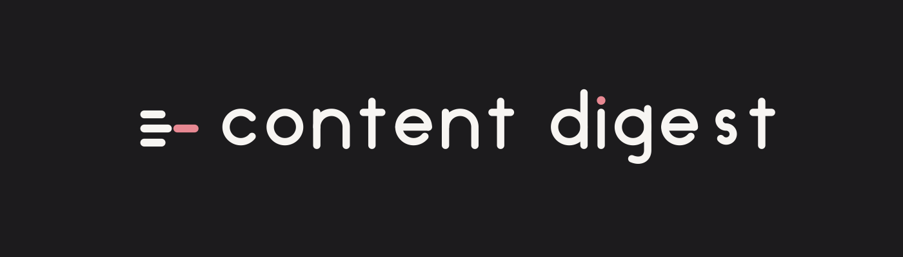

<!-- BANNER: uncomment once design/github/readme-banner-{light,dark}-1400x400.png exist.
<p align="center">
  <picture>
    <source media="(prefers-color-scheme: dark)"  srcset="design/github/readme-banner-dark-1400x400.png">
    <source media="(prefers-color-scheme: light)" srcset="design/github/readme-banner-light-1400x400.png">
    
  </picture>
</p>
-->

<h1 align="center">Content Digest</h1>

<p align="center"><b>Saves anything you find, summarizes it with a local LLM, and turns it into a knowledge base you can question.</b></p>

<p align="center">
  
  
  
  
  <a href="LICENSE"></a>
</p>

## What it does

- Saves a URL from the Mac menu bar, the iPhone share sheet, a Chrome extension, or a Shortcut.
- Summarizes each item in 150 to 200 words with action pointers, using a local model.
- Categorizes and tags every item automatically.
- Answers plain-language questions about everything you have saved.
- Emails a morning brief of what is worth returning to.
- Keeps every byte on your own machine.

## Features

### Capture

- **Menu bar capture.** Click the icon, paste a URL, get a summary in seconds.
- **iPhone share sheet.** A Shortcut posts to the server's authenticated endpoint.
- **Chrome extension.** One click sends rendered page text, so logged-in-only pages such as Reddit and LinkedIn work.
- **Inbox capture before auth.** URLs are accepted first and processed after, so nothing is dropped.
- **Self-healing capture.** Fetch failures retry every 6 hours up to 3 attempts; inbox URLs that never became items are re-queued.
- **URL normalization.** Tracking parameters (`utm_*`, `fbclid`, `share_id`, `si`) are stripped before dedupe and storage.
- **Canonical URL dedupe.** The same article saved twice stays one item.

### Extraction

- **Source-aware extractor registry.** Per-source handlers rather than one parser for everything.
- **Reddit without API approval.** Threads and top comments from old.reddit.com, with the arctic-shift archive as automatic fallback.
- **YouTube transcripts.** Pulled via `youtube-transcript-api`.
- **X posts.** Fetched through fxtwitter.
- **Everything else via trafilatura.** Replaced the original regex extraction and made summaries materially cleaner.
- **Reader-proxy fallback.** Blocked sites route through a reader proxy instead of failing.
- **Fetch failure guard.** If extraction fails, the model is never called and you get a clear notification instead of a fabricated summary.

### Knowledge base

- **Ask your knowledge base.** A question box over your own saved items, using local Ollama embeddings (`nomic-embed-text`) with keyword fallback, answering with cited sources.
- **Item states.** Mark any card Act, Later, or Archive; states filter the base and appear in the brief.
- **Search and sort.** Full-text search with date and time on every card.
- **Persistent delete.** Removing an item removes it from storage, not just the view.
- **LLM output validation.** Category whitelist, relevance bounds, and shape checks before anything is saved.

### Daily brief

- **Morning email brief.** HTML digest sent on a LaunchAgent schedule.
- **Item states as pills.** Archived items are excluded.
- **Timezone-aware timestamps.**

### Model routing

- **Local first.** Ollama or LM Studio on the local machine does the summarizing.
- **Cloud fallback.** Groq is used only when the local model is unreachable.

## Stack

- App: Python, rumps menu bar app
- Extraction: trafilatura, youtube-transcript-api
- Local inference: LM Studio or Ollama
- Fallback inference: Groq
- Storage: plain JSON, plain HTML knowledge base
- Capture surfaces: iOS Shortcuts, Chrome extension (Manifest V3)

## Install

Requires: Python 3.11 or later, LM Studio or Ollama running locally, Homebrew.

```bash
git clone https://github.com/ShashankKarpal/content-digest-app.git
cd content-digest-app
pip3 install rumps trafilatura youtube-transcript-api --break-system-packages
ollama pull nomic-embed-text        # optional, enables semantic ask
python3 app.py
```

## Configuration

Copy `secrets.example.json` to `secrets.json` and fill it in. `secrets.json` and `config.json` are gitignored and never committed.

```json
{
  "auth_token": "YOUR_TOKEN_HERE",
  "groq_api_key": "YOUR_GROQ_KEY_HERE",
  "smtp_user": "YOUR_EMAIL_HERE",
  "smtp_password": "YOUR_APP_PASSWORD_HERE",
  "recipient": "YOUR_EMAIL_HERE"
}
```

Set the server address in `local_settings.py` (also gitignored). Never commit a LAN, tailnet, or VPN address.

Real credentials live only on local machines. Nothing in this repository holds a working secret.

## Usage

**iPhone Shortcut.** Create a shortcut with a Get Contents of URL action:

- URL: `http://YOUR_MAC_IP:7778/add`
- Method: POST
- Headers: `Authorization: Bearer YOUR_AUTH_TOKEN`
- Body: JSON with key `url`

**Chrome extension.** Open `chrome://extensions`, enable Developer mode, Load unpacked, select `extension/`. Set your server URL and auth token in the extension options.

## Project structure

```
app.py            menu bar app
server.py         HTTP server, extraction, summarization, knowledge base
client.py         lightweight menu bar client
extractors.py     per-source extractor registry
daily_brief.py    morning email brief
extension/        Chrome extension
design/           brand assets, tokens, BRAND.md
screenshots/      UI screenshots
```

## Roadmap

| Version | Goal | Status |
|---|---|---|
| v0.1 | Frictionless capture and trustworthy summaries | Shipped |
| v0.2 | Return loop: digest email and item states | Shipped |
| v0.3 | Search, timezone-aware timestamps, reader-proxy fallback | Shipped |
| v0.4 | Reddit, extractor registry, ask-your-KB, Chrome extension | Shipped |
| v1 | Personalization: surface content based on what you act on | Planned |

## Known limitations

- A local model, or the Groq fallback, must be reachable for summarization.
- The Mac address changes across networks; update the iPhone shortcut if capture stops working.
- YouTube videos without transcripts hit the fetch failure guard rather than guessing from the title.
- LinkedIn saved-post harvesting is not built; the Chrome extension covers individual pages.

## Privacy

Everything is local: saved items, summaries, embeddings, and the knowledge base live in plain files on your own machine. The only outbound traffic is fetching the pages you ask for, the optional Groq fallback when the local model is down, and the brief email you configure.

## License

MIT. See [LICENSE](LICENSE).

## Author

Built by Shashank Karpal, with credit to u/sunlesshalo and Karl for the original idea.

> Designed and built with Claude (Anthropic).
